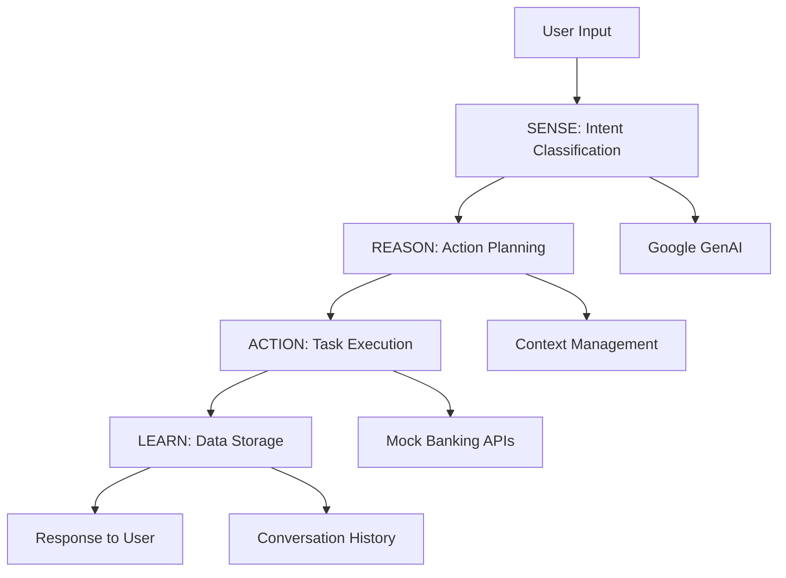

# 🏦 AI Banking Chatbot

[](https://www.python.org/downloads/)
[](https://ai.google.dev/)()

A conversational AI banking assistant powered by Google GenAI that handles various banking operations through natural language interaction. Built with a **Sense → Reason → Action → Learn** framework for intelligent customer service.

<div align="center">
  
</div>

## ✨ Features

- 🤖 **Intelligent Intent Classification** - Automatically understands customer requests
- 💬 **Human-like Conversations** - Natural language processing with context awareness
- 🏧 **Complete Banking Services** - Account management, loans, card services
- 🔄 **Multi-turn Conversations** - Maintains context across interactions
- 🛡️ **Secure Processing** - Mock APIs simulate real banking security
- 📊 **Learning System** - Continuously improves from interactions
- ⚡ **Real-time Processing** - Instant responses with realistic delays

## 🎯 Supported Banking Operations

| Category | Services |
|----------|----------|
| **Account Services** | Balance inquiry, Transaction history, Account details |
| **Loan Services** | Personal loans, Home loans, Car loans with credit checks |
| **Card Services** | Card blocking, New card requests |
| **Information** | Interest rates, Service charges, General banking info |

## 🚀 Quick Start

### Prerequisites
- Python 3.8 or higher
- Google GenAI API key ([Get one here](https://makersuite.google.com/app/apikey))

### Installation

1. **Clone the repository**
   ```bash
   git clone https://github.com/yourusername/banking-chatbot.git
   cd banking-chatbot
   ```

2. **Install dependencies**
   ```bash
   pip install google-generativeai
   ```

3. **Configure API Key**
   ```python
   # Edit banking_chatbot.py line 10
   genai.configure(api_key='YOUR_GOOGLE_API_KEY')
   ```

4. **Run the chatbot**
   ```bash
   python banking_chatbot.py
   ```

## 💬 Demo Conversations

### Account Balance Inquiry
```
👤 User: Check my account balance
🤖 Bot: I'll need your account number. Could you please provide your 8-digit account number?
👤 User: 12345678
🤖 Bot: Hello John Doe! 

Your account balance details:
• Account Number: 12345678
• Account Type: Savings
• Available Balance: ₹15,000.50

Is there anything else I can help you with?
```

### Loan Application
```
👤 User: I want to apply for a personal loan of 5 lakhs
🤖 Bot: I'll need your account number to proceed with this request.
👤 User: 12345678
🤖 Bot: Loan Application Processed!

Application ID: LOAN123456
Status: Approved

Congratulations! Your Personal Loan application for ₹5,00,000.00 has been approved.
Your credit score: 750
```

### Card Blocking
```
👤 User: Block my debit card immediately
🤖 Bot: I need your account number to proceed with this request.
👤 User: 12345678
🤖 Bot: Your debit card has been successfully blocked for security.

• Card Status: BLOCKED
• Date & Time: 2024-07-27 14:30:25
• Reason: Customer Request

A new card will be dispatched to your registered address within 5-7 business days.
```

## 🏗️ Architecture

The system implements a sophisticated **Sense → Reason → Action → Learn** framework:



### Core Components

- **🧠 BankingChatbot**: Main orchestrator implementing the SRAL framework
- **🏦 MockBankingAPI**: Realistic banking service simulation
- **🎯 Intent Classifier**: Three-tier classification system
- **💾 Context Manager**: Maintains conversation state
- **📚 Learning System**: Stores interactions for improvement

## 📊 Intent Classification System

The chatbot categorizes all requests into three intelligent tiers:

| Tier | Category | Examples | Requirements |
|------|----------|----------|--------------|
| 1 | **Basic Query** | Interest rates, charges, general info | None |
| 2 | **Account Query** | Balance, transactions, account details | Account number |
| 3 | **Specific Task** | Loan applications, card blocking | Account + additional info |

## 🛠️ Technical Details

### Built With
- **Python 3.8+** - Core language
- **Google GenAI** - Natural language understanding
- **Mock APIs** - Banking service simulation
- **JSON** - Data serialization
- **Regex** - Entity extraction

### Key Classes

#### `BankingChatbot`
Main conversation handler implementing the SRAL framework.

```python
def chat(self, user_input: str) -> str:
    classification = self.sense(user_input)      # Understand intent
    reasoning = self.reason(classification)      # Plan actions
    response = self.action(reasoning)            # Execute tasks
    self.learn(user_input, response)            # Store interaction
    return response
```

#### `MockBankingAPI`
Comprehensive banking service simulation with realistic data and processing.

```python
# Sample account data
accounts = {
    "12345678": {
        "customer_name": "John Doe",
        "balance": 15000.50,
        "credit_score": 750
    }
}
```

## 🔧 Configuration

### Environment Variables (Recommended)
```bash
# .env file
GOOGLE_API_KEY=your_actual_api_key_here
```

### Custom Mock Data
Modify `MockBankingAPI.__init__()` to add:
- More customer accounts
- Additional transaction history
- Custom interest rates
- Different credit scores

## 🧪 Testing

### Manual Testing
Use these commands during conversation:
- `quit` - Exit the chatbot
- `reset` - Clear conversation context
- `context` - View current conversation state

### Sample Test Accounts
| Account Number | Customer | Balance | Credit Score |
|----------------|----------|---------|--------------|
| 12345678 | John Doe | ₹15,000.50 | 750 |
| 87654321 | Jane Smith | ₹25,000.75 | 680 |

### Unit Testing
```bash
python -m pytest tests/
```

## 📈 Performance Features

- **⚡ Fast Response**: Average response time < 2 seconds
- **🧠 Context Awareness**: Remembers conversation history
- **🔄 Error Recovery**: Graceful handling of invalid inputs
- **📊 Learning**: Improves from each interaction
- **🛡️ Security**: Input validation and sanitization

## 🚀 Production Deployment

### Docker
```dockerfile
FROM python:3.9-slim
WORKDIR /app
COPY requirements.txt .
RUN pip install -r requirements.txt
COPY . .
CMD ["python", "banking_chatbot.py"]
```

### Web Service (Flask)
```python
from flask import Flask, request, jsonify

app = Flask(__name__)
bot = BankingChatbot()

@app.route('/chat', methods=['POST'])
def chat():
    message = request.json['message']
    response = bot.chat(message)
    return jsonify({'response': response})
```

### Cloud Deployment
- **Google Cloud Run** - Serverless containers
- **AWS Lambda** - Function-as-a-Service
- **Azure Container Instances** - Container hosting

## 🤝 Contributing

We welcome contributions! Here's how to get started:

1. **Fork** the repository
2. **Create** a feature branch (`git checkout -b feature/amazing-feature`)
3. **Commit** your changes (`git commit -m 'Add amazing feature'`)
4. **Push** to the branch (`git push origin feature/amazing-feature`)
5. **Open** a Pull Request

### Development Guidelines
- Follow PEP 8 style guide
- Include unit tests for new features
- Update documentation for changes
- Test with multiple conversation scenarios


## 📝 Changelog

### v1.0.0 (Current)
- ✅ Core banking operations
- ✅ Google GenAI integration
- ✅ Mock API system
- ✅ Context management
- ✅ Learning framework

### Planned Features
- 🔄 Real banking API integration
- 🌐 Web interface
- 📱 Mobile app support
- 🔐 Enhanced security features
- 📊 Analytics dashboard

---

<div align="center">

